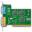

Infrastructure as Code (IaC) specifically for Windows
=====================================================

	

		

			

				
			

			

				<i>Everything you need to create, configure and update Windows Servers  - and continously deliver your applications.</i>
			

		

		

			

				<h2>Bootstrap Cloud servers</h2>
				Automatically bootstrap cloud servers and use the built-in DSL to configure them.
			

			

				<h2>Deploy applications</h2>
				Syncronize files and folders to any remote server. Native support for deploying web applications to IIS.
			

		

		

			

				<h2>Install packages</h2>
				Install MSI packages and other installation packages to remote servers.
			

			

				<h2>Execute Scripts</h2>
				Execute remote PowerShell or DOS commands/scripts.
			

		

		

			

				<h2>Configure Infrastructure</h2>
				Configure IIS, SSL certificates, add/remove Windows features and more.
			

			

				<h2>Operate Load Balancers</h2>
				Take nodes off and online automatically to prevent any downtime.
			

		

	

*Find out more in the [documentation](/docs/)*
